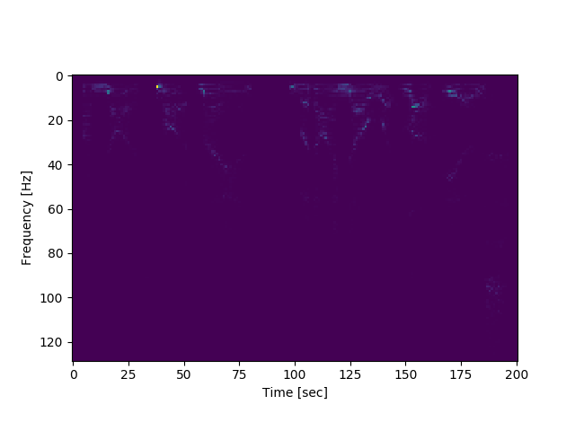

# music_dl
Experiments with music and deep learning

## Playing a sound file and printing metadata
```python3
python3 -W ignore play_audio.py

File Name: not_smart
Artist: None
Duration: 4.09 seconds
Bitrate: 86.13 kBits/s
Size: 44.1 kilobytes
Sample Rate: 11025
```

## Generating Spectrogram of the sound file

```python3
python3 generate_spectrogram.py
```

